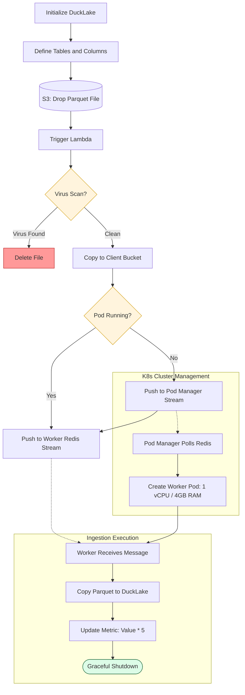

# secure-parquet-ingestion
Event-driven Parquet ingestion pipeline with virus scanning, Redis Streams Orchestration, Kubernetes workers and Duck lake Storage.

# 🦆 Secure Parquet → DuckLake Pipeline


## Introduction

This project is a simple, reliable pipeline for safely moving Parquet files into DuckLake.  
Files uploaded to S3 are automatically scanned for viruses, queued through Redis, and processed in Kubernetes worker pods.  
Once ingested, the data is stored in DuckLake, with an optional step to update a metric column.

**Flow:**  
`S3 Landing → Lambda Virus Scan → Redis Streams → K8s Worker → DuckLake`

---

## Features

- Automatically scans files for viruses  
- Keeps landing, trusted, and quarantine buckets separate  
- Uses Redis Streams to manage ingestion jobs reliably  
- Runs worker pods on Kubernetes with set resources (4Gi RAM, 1 vCPU)  
- Creates tables in DuckLake automatically and updates metrics  
- Designed to handle duplicates and retries safely  

---

## Quick Start

```bash
1. Start Redis
docker run -p 6379:6379 redis:7

2. Run worker locally
cd worker
pip install -r requirements.txt
python worker.py

3. Publish test job
redis-cli XADD ingestion_requests * \
  job_id abc123 \
  client_id clientA \
  bucket client-bucket \
  key clientA/incoming/test.parquet

```

---

## Repo Structure

lambda/         # scan + routing
pod-manager/    # ensures workers exist
worker/         # ingestion
k8s/            # manifests
scripts/        # deploy / run helpers

---
## ☁️ Deployment

### AWS Setup

**1. Create S3 buckets**

- Landing bucket  
- Trusted client bucket  
- Quarantine bucket  

**2. Configure S3 Event Trigger**

- Event: `ObjectCreated`
- Prefix: `uploads/`
- Target: Lambda function

**3. Deploy Lambda**

- Include ClamAV layer for virus scanning  
- Configure required environment variables  
- Ensure IAM permissions:

  - `s3:GetObject` on landing bucket  
  - `s3:PutObject` on trusted / quarantine buckets  
  - `s3:DeleteObject` on landing bucket  

---

### Kubernetes Setup

- Deploy Redis (or use AWS ElastiCache)  
- Deploy Pod Manager as a Kubernetes Deployment  
- Ensure Pod Manager has RBAC permission to create worker pods  

**Worker Pod Resources**
- Memory: `4Gi`
- CPU: `1 vCPU`

---

## 🧯 Troubleshooting

### Lambda triggers but no job runs

- Check Redis connectivity (VPC / security groups)  
- Verify Redis stream exists  
- Check Lambda logs for publish errors  

---

### Worker pod starts and exits immediately

- Redis URL or authentication may be incorrect  
- Consumer group not created  
- Worker idle timeout set too low  

---

### Duplicate ingestion happens

- Ensure `job_id` is deterministic  
- Make sure job state store is enabled  
- Worker should verify job status before processing

---
### Detailed Workflow


